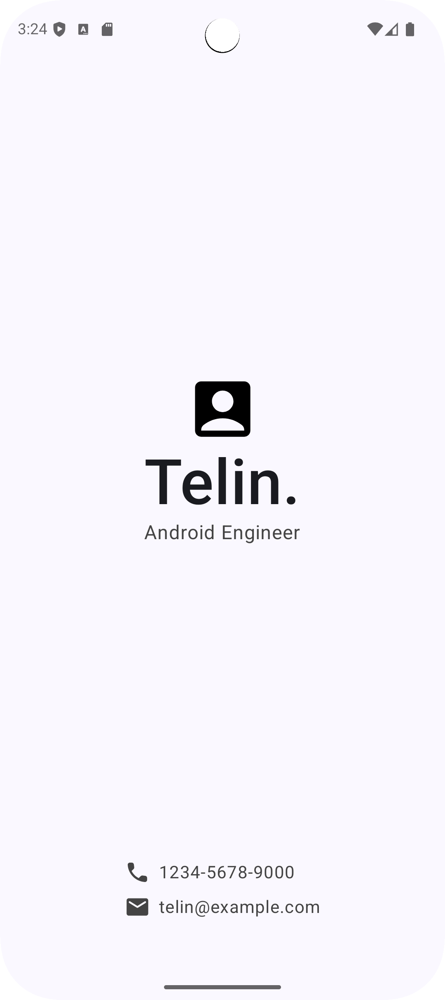

# プロジェクト:名刺アプリを作成する

[Android developer - プロジェクト:名刺アプリを作成する](https://developer.android.com/codelabs/basic-android-kotlin-compose-business-card?hl=ja&continue=https%3A%2F%2Fdeveloper.android.com%2Fcourses%2Fpathways%2Fandroid-basics-compose-unit-1-pathway-3%3Fhl%3Dja%23codelab-https%3A%2F%2Fdeveloper.android.com%2Fcodelabs%2Fbasic-android-kotlin-compose-business-card#0)

