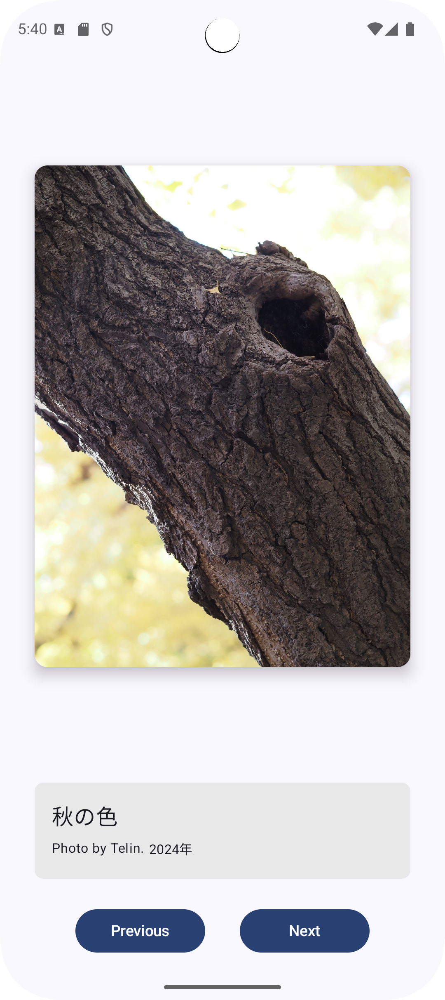
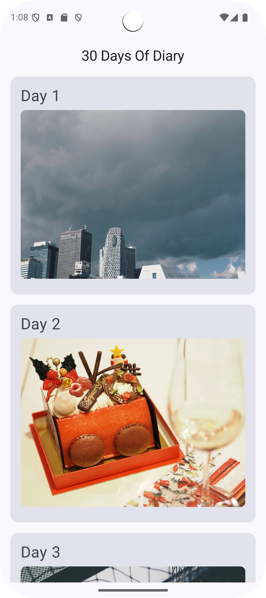
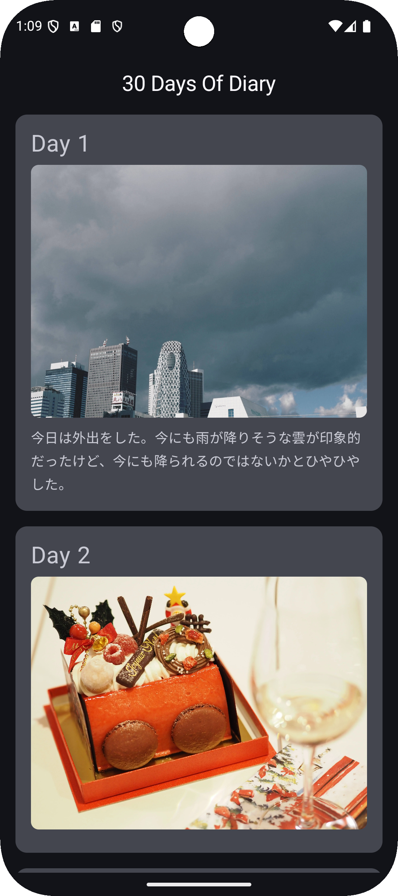

# BasicComposeProjects

『COMPOSE を用いた ANDROID アプリ開発の基礎』のプロジェクト課題レビュー解答用プロジェクト

## ユニット1: 名刺アプリを作成する

- サンプルコード: [BuisinessCardApp]()
- [プロジェクト課題ページ](https://developer.android.com/codelabs/basic-android-kotlin-compose-business-card?hl=ja&continue=https%3A%2F%2Fdeveloper.android.com%2Fcourses%2Fpathways%2Fandroid-basics-compose-unit-1-pathway-3%3Fhl%3Dja%23codelab-https%3A%2F%2Fdeveloper.android.com%2Fcodelabs%2Fbasic-android-kotlin-compose-business-card#0)

## ユニット2: アートスペース アプリを作成する

- サンプルコード: [ArtSpaceApp]()
- [プロジェクト課題ページ](https://developer.android.com/codelabs/basic-android-kotlin-compose-art-space?hl=ja&continue=https%3A%2F%2Fdeveloper.android.com%2Fcourses%2Fpathways%2Fandroid-basics-compose-unit-2-pathway-3%3Fhl%3Dja%23codelab-https%3A%2F%2Fdeveloper.android.com%2Fcodelabs%2Fbasic-android-kotlin-compose-art-space#0)

## ユニット3: 30 日間アプリの作成

- サンプルコード: [30DaysOfDiary]]()
- [プロジェクト課題ページ](https://developer.android.com/codelabs/basic-android-kotlin-compose-30-days?hl=ja&continue=https%3A%2F%2Fdeveloper.android.com%2Fcourses%2Fpathways%2Fandroid-basics-compose-unit-3-pathway-3%3Fhl%3Dja%23codelab-https%3A%2F%2Fdeveloper.android.com%2Fcodelabs%2Fbasic-android-kotlin-compose-30-days#0)

