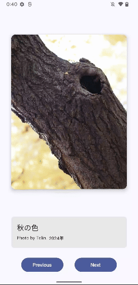
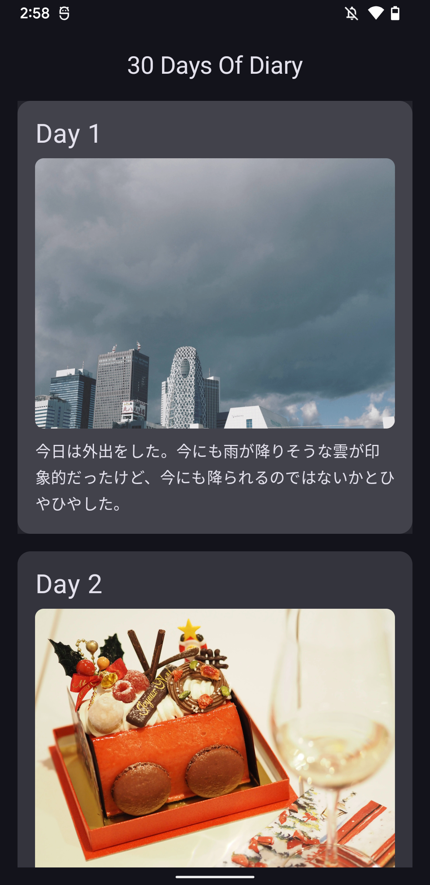
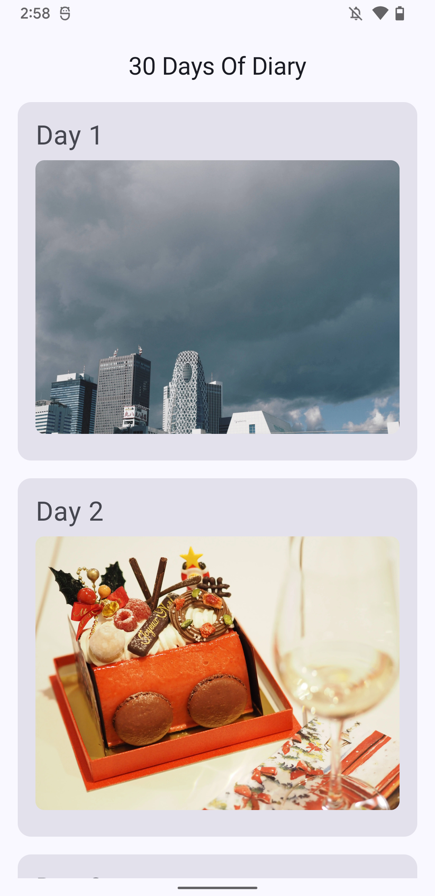
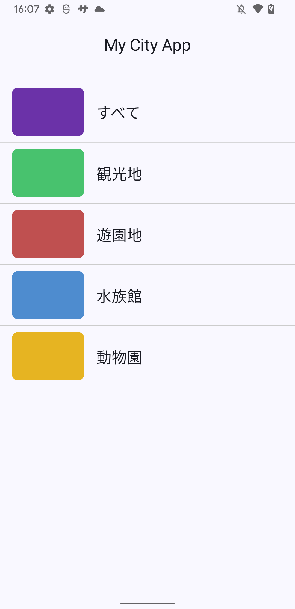
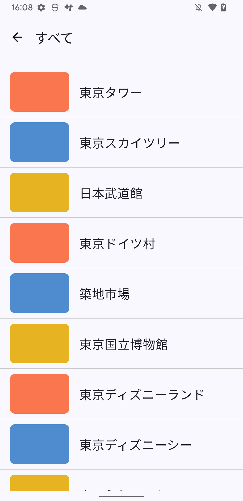
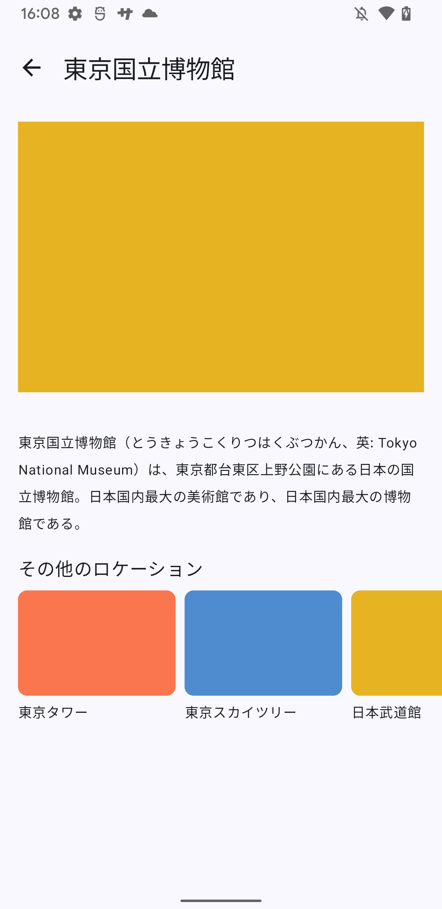
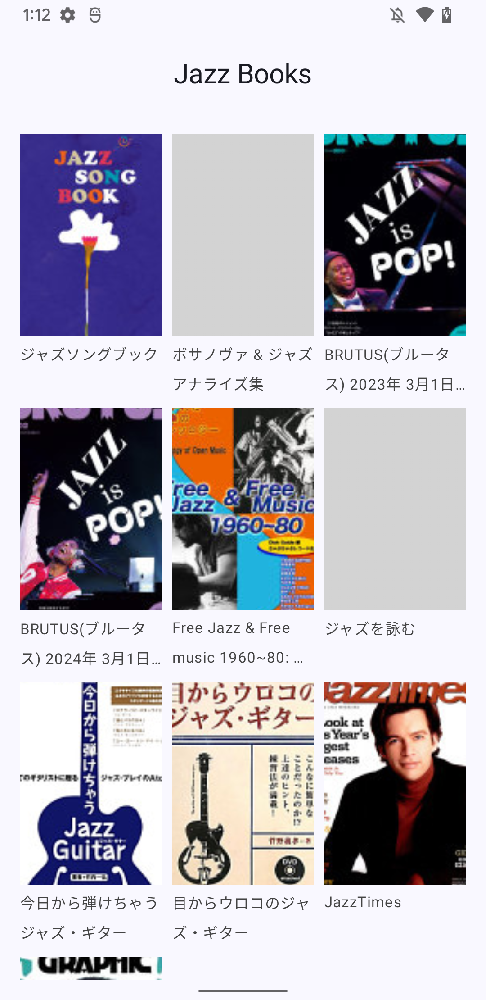

# BasicComposeProjects

『COMPOSE を用いた ANDROID アプリ開発の基礎』のプロジェクト課題レビュー参考用プロジェクト

## ユニット1: 名刺アプリを作成する

- サンプルコード: [BuisinessCardApp](https://github.com/yasukotelin/BasicComposeProjects/tree/main/BusinessCardApp)
- [プロジェクト課題ページ](https://developer.android.com/codelabs/basic-android-kotlin-compose-business-card?hl=ja&continue=https%3A%2F%2Fdeveloper.android.com%2Fcourses%2Fpathways%2Fandroid-basics-compose-unit-1-pathway-3%3Fhl%3Dja%23codelab-https%3A%2F%2Fdeveloper.android.com%2Fcodelabs%2Fbasic-android-kotlin-compose-business-card#0)

### サンプルコードのポイント

- data classを使ったデータの表現
- weightを活用したレイアウト実装

## ユニット2: アートスペース アプリを作成する

- サンプルコード: [ArtSpaceApp](https://github.com/yasukotelin/BasicComposeProjects/tree/main/ArtSpaceApp)
- [プロジェクト課題ページ](https://developer.android.com/codelabs/basic-android-kotlin-compose-art-space?hl=ja&continue=https%3A%2F%2Fdeveloper.android.com%2Fcourses%2Fpathways%2Fandroid-basics-compose-unit-2-pathway-3%3Fhl%3Dja%23codelab-https%3A%2F%2Fdeveloper.android.com%2Fcodelabs%2Fbasic-android-kotlin-compose-art-space#0)

### サンプルコードのポイント

- Composableを適切な粒度で実装
- HorizontalPagerを活用した画像の表示
- Animationを使ったfade切り替え

## ユニット3: 30 日間アプリの作成

- サンプルコード: [30DaysOfDiary](https://github.com/yasukotelin/BasicComposeProjects/tree/main/30DaysOfDiary)
- [プロジェクト課題ページ](https://developer.android.com/codelabs/basic-android-kotlin-compose-30-days?hl=ja&continue=https%3A%2F%2Fdeveloper.android.com%2Fcourses%2Fpathways%2Fandroid-basics-compose-unit-3-pathway-3%3Fhl%3Dja%23codelab-https%3A%2F%2Fdeveloper.android.com%2Fcodelabs%2Fbasic-android-kotlin-compose-30-days#0)

### サンプルコードのポイント

- Dark/Lightテーマの対応
- LazyListを使った遅延読み込み表示
- 折りたたみ表示
- 画像パフォーマンスのためのCoilを使ったローカル画像の表示

## ユニット4: My City アプリを作成する

- サンプルコード: [MyCityApp](https://github.com/yasukotelin/BasicComposeProjects/tree/main/MyCityApp)
- [プロジェクト課題ページ](https://developer.android.com/codelabs/basic-android-kotlin-compose-my-city?hl=ja&continue=https%3A%2F%2Fdeveloper.android.com%2Fcourses%2Fpathways%2Fandroid-basics-compose-unit-4-pathway-3%3Fhl%3Dja%23codelab-https%3A%2F%2Fdeveloper.android.com%2Fcodelabs%2Fbasic-android-kotlin-compose-my-city#0)

### サンプルコードのポイント

- Navigation composeを活用した画面遷移の実装
- モデルの定義
- Chat GPTを活用したテストデータの作成
- 詳細画面のカルーセル表示（LazyRow）
- kotlinx.serializableによる型安全な画面遷移

## ユニット5: Bookshelfアプリの作成

- サンプルコード: [BookshelfApp](https://github.com/yasukotelin/BasicComposeProjects/tree/main/BookshelfApp)
- [プロジェクト課題ページ](https://developer.android.com/codelabs/basic-android-kotlin-compose-bookshelf?hl=ja&continue=https%3A%2F%2Fdeveloper.android.com%2Fcourses%2Fpathways%2Fandroid-basics-compose-unit-5-pathway-2%3Fhl%3Dja%23codelab-https%3A%2F%2Fdeveloper.android.com%2Fcodelabs%2Fbasic-android-kotlin-compose-bookshelf#0)

</div

### サンプルコードのポイント

- グリット表示
- Google Boooks APIを活用したAPI通信
    - Retrofit2を使ったHTTPS通信
    - kotlinx.serializerを使ったJSONパース処理
- Coilを使ってネットワーク画像の表示
- Hiltを使ったDI処理
- ViewModel
- StateFlow
- データレイヤーを意識したパッケージ構成